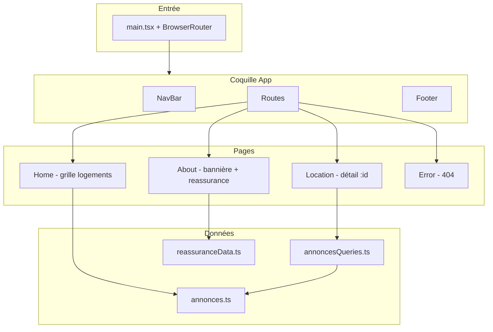

# Kasa — Dossier de présentation technique  
**Destinataire :** chef de projet / lead développeur  
**Objectif :** cadrer l’architecture, les choix techniques et les fonctionnalités livrées, avec extraits de code ciblés pour l’oral.

---

## 1. Contexte et périmètre

**Kasa** est une application web de location de logements entre particuliers (projet type OpenClassrooms). L’application permet de :

- parcourir une liste de logements ;
- accéder à une page institutionnelle / valeurs (bannière + blocs repliables) ;
- consulter le détail d’un logement (galerie, infos, description, équipements) ;
- gérer les routes inexistantes (404).

**Stack :** React 19, TypeScript, Vite 7, React Router 7, Sass (modules SCSS), ESLint.

---

## 2. Architecture globale

### 2.1 Point d’entrée et routage

Le routeur enveloppe toute l’application au plus haut niveau ; les routes sont déclarées dans `App.tsx`, avec une coquille commune (navbar + contenu + footer).

```7:13:src/main.tsx
createRoot(document.getElementById("root")!).render(
    <StrictMode>
        <BrowserRouter>
            <App />
        </BrowserRouter>
    </StrictMode>,
);
```

```23:35:src/App.tsx
function App() {
    return (
        <main className={css.app}>
            <NavBar />
            <Routes>
                <Route path="/" element={<Home />} />
                <Route path="/about" element={<About />} />
                <Route path="/location/:id" element={<Location />} />
                <Route path="*" element={<Error />} />
            </Routes>
            <Footer />
        </main>
    );
}
```

**À dire à l’oral :** séparation claire entre **configuration des routes** (`App`) et **pages** (`pages/*`). Le `path="*"` capte toute URL non déclarée pour afficher la page d’erreur.

### 2.2 Arborescence fonctionnelle (simplifiée)



### 2.3 Organisation des dossiers `src/`

| Zone | Rôle |
|------|------|
| `pages/` | Écrans routés : composition de composants, peu de logique métier. |
| `components/` | UI réutilisable (slider, collapse, carte, header fiche, etc.) + layout (`NavBar`, `Footer`). |
| `data/` | Données statiques typées (`Annonce`, `Host`) + helpers (`getAnnonceById`). |
| `styles/` | Styles globaux partagés (imports layout). |
| `App.module.scss` | Typo globale, layout colonne, `min-height` pour le sticky footer. |

**Principe :** les **pages** orchestrent ; les **composants** encapsulent le rendu et le style local ; les **données** restent centralisées et typées.

---

## 3. Modèle de données

Les annonces sont décrites par une interface TypeScript exportée ; le tableau est importé là où on en a besoin (liste, résolution par id).

```1:17:src/data/annonces.ts
export interface Host {
    name: string;
    picture: string;
}

export interface Annonce {
    id: string;
    title: string;
    cover: string;
    pictures: string[];
    description: string;
    host: Host;
    rating: string;
    location: string;
    equipments: string[];
    tags: string[];
}
```

La résolution d’une annonce pour la page détail est isolée pour la **maintenabilité** et éviter de dupliquer le `find` :

```1:4:src/data/annoncesQueries.ts
import ANNONCES, { type Annonce } from "./annonces";

export const getAnnonceById = (id: string | undefined): Annonce | undefined =>
    ANNONCES.find((annonce) => annonce.id === id);
```

**À dire à l’oral :** aujourd’hui les données sont **mockées en local** ; demain on remplace `ANNONCES` par un appel API en conservant `Annonce` et `getAnnonceById` (ou en les adaptant à une couche service).

---

## 4. Fonctionnalités par écran

### 4.1 Navigation et lien actif

Les liens utilisent `NavLink` : React Router applique une classe selon que la route courante correspond au `to`. `end` sur l’accueil évite d’activer « Accueil » sur `/location/...`.

```9:25:src/components/layout/NavBar/NavBar.tsx
                    <NavLink
                        to="/"
                        end
                        className={({ isActive }) =>
                            isActive ? "link link--active" : "link"
                        }
                    >
                        Acceuil
                    </NavLink>
                    <NavLink
                        to="/about"
                        className={({ isActive }) =>
                            isActive ? "link link--active" : "link"
                        }
                    >
                        A-Propos
                    </NavLink>
```

Les styles actif / inactif sont dans `NavBar.scss` (couleur + soulignement pour `.link--active`).

---

### 4.2 Accueil (`/`) — liste des logements

La page mappe le jeu de données et délègue l’affichage d’une carte à `ListingCard` ; la navigation vers le détail se fait avec `useNavigate`.

```6:21:src/pages/Home/index.tsx
const Home = () => {
    const navigate = useNavigate();

    return (
        <main className={styles.main}>
            <section className={styles.grid}>
                {ANNONCES.map((annonce) => (
                    <ListingCard
                        key={annonce.id}
                        cover={annonce.cover}
                        title={annonce.title}
                        onClick={() => navigate(`/location/${annonce.id}`)}
                    />
                ))}
            </section>
        </main>
    );
};
```

**Intérêt composant `ListingCard` :** même présentation partout, props explicites (`cover`, `title`, `onClick`), accessibilité de base (rôle bouton, clavier).

---

### 4.3 À propos (`/about`) — bannière et valeurs

Bannière réutilisable + liste de blocs `Reassurance` (accordéon avec animation de hauteur dans le composant dédié). Données dans `reassuranceData.ts`.

---

### 4.4 Détail logement (`/location/:id`)

**Flux :** lecture du paramètre `id` → `getAnnonceById` → si absent, message d’erreur léger ; sinon composition de blocs métier.

```9:41:src/pages/Location/index.tsx
const Location = () => {
    const { id } = useParams<{ id: string }>();
    const annonce = getAnnonceById(id);

    if (!annonce) {
        return (
            <main className={styles.main}>
                <p>Cette annonce n&apos;existe pas.</p>
            </main>
        );
    }

    return (
        <main className={styles.main}>
            <ImageSlider images={annonce.pictures} altBase={annonce.title} />

            <AnnonceHeader
                title={annonce.title}
                location={annonce.location}
                tags={annonce.tags}
                host={annonce.host}
                rating={annonce.rating}
            />

            <section className={styles.details}>
                <Collapse title="Description">
                    <p>{annonce.description}</p>
                </Collapse>
                <Collapse title="Équipements">
                    <EquipmentsList items={annonce.equipments} />
                </Collapse>
            </section>
        </main>
    );
};
```

**Points à mettre en avant à l’oral :**

1. **`ImageSlider`** — carrousel : index courant, boucle prev/next, compteur si plusieurs images, reset de l’index quand le tableau `images` change (changement d’annonce).

```10:28:src/components/ImageSlider/ImageSlider.tsx
const ImageSlider = ({ images, altBase }: ImageSliderProps) => {
    const [currentIndex, setCurrentIndex] = useState(0);
    const total = images.length;

    useEffect(() => {
        setCurrentIndex(0);
    }, [images]);

    if (total === 0) {
        return null;
    }

    const goToPrevious = () => {
        setCurrentIndex((prev) => (prev === 0 ? total - 1 : prev - 1));
    };

    const goToNext = () => {
        setCurrentIndex((prev) => (prev === total - 1 ? 0 : prev + 1));
    };
```

2. **`AnnonceHeader` + `RatingStars`** — en-tête et notation factorisés, réutilisables si une autre vue affiche la même brique.

3. **`Collapse`** — accordéon générique (titre + `children`), état fermé par défaut sur la fiche ; animation d’ouverture via CSS `grid-template-rows` (fichier `Collapse.module.scss`).

```10:34:src/components/Collapse/Collapse.tsx
const Collapse = ({ title, defaultOpen = false, children }: CollapseProps) => {
    const [open, setOpen] = useState(defaultOpen);

    return (
        <div className={styles.root}>
            <button
                type="button"
                className={styles.header}
                onClick={() => setOpen((prev) => !prev)}
            >
                {title}
                <span
                    className={`${styles.arrow} ${open ? styles.arrowOpen : ""}`}
                >
                    ❯
                </span>
            </button>
            <div
                className={`${styles.body} ${open ? styles.bodyOpen : ""}`}
            >
                <div className={styles.inner}>
                    <div className={styles.content}>{children}</div>
                </div>
            </div>
        </div>
    );
};
```

4. **`EquipmentsList`** — liste purement présentationnelle, injectée dans le `Collapse` « Équipements ».

---

### 4.5 Page 404

Route catch-all `*` dans `App.tsx` → composant `Error` dédié (message + éventuellement lien retour selon implémentation).

---

## 5. Styles et cohérence UI

- **SCSS modules** (`*.module.scss`) : styles **scopés** par composant ou page, moins de collisions qu’avec du CSS global.
- **Couleur marque** : `#ff6060` (titres fiche, tags, en-têtes des collapses, étoiles pleines).
- **Navbar / Footer** : SCSS « classique » avec classes globales (`nav-main`, etc.) importées depuis `styles/index.scss` ou `App.module.scss` selon le fichier du projet.

---

## 6. Build et qualité

- **`npm run build`** : `tsc -b` puis `vite build` — typage vérifié avant bundle.
- **`npm run lint`** : ESLint + règles React / hooks.

---

## 7. Pistes d’évolution (pour clôturer l’oral)

| Sujet | Piste |
|--------|--------|
| Données | Remplacer le mock par une API REST + `fetch` / TanStack Query, gestion loading / erreur. |
| SEO | React Router + meta par route ou framework full-stack si besoin. |
| Tests | Tests composants (RTL) sur `Collapse`, `ImageSlider`, navigation. |
| Homogénéité | Aligner `Reassurance` sur le composant `Collapse` pour un seul pattern d’accordéon. |
| Assets | Vérifier chemins Vite (`public/` servi à la racine) pour la bannière. |

---

## 8. Fil de présentation suggéré (≈ 5–8 min)

1. **Produit** : parcours utilisateur (liste → détail ; à propos ; 404).  
2. **Technique** : React + TS + Vite, Router, Sass modules.  
3. **Architecture** : `main` → `App` → routes + pages + composants + `data`.  
4. **Code clé** : montrer `App.tsx` (routes), `Location` (composition), un composant réutilisable (`Collapse` ou `ImageSlider`).  
5. **Données** : interface `Annonce` + `getAnnonceById`.  
6. **Qualité / suite** : build, lint, évolutions API et tests.

---

*Document généré à partir du dépôt Kasa-app — à ajuster si le périmètre ou les routes évoluent.*
